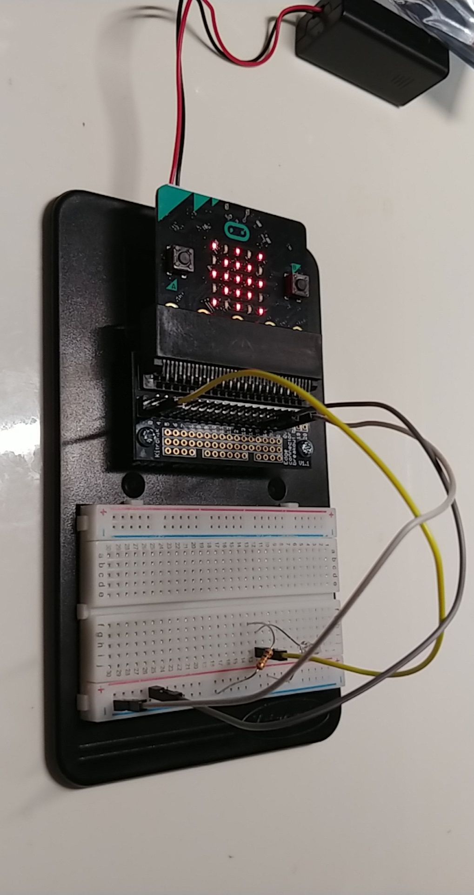
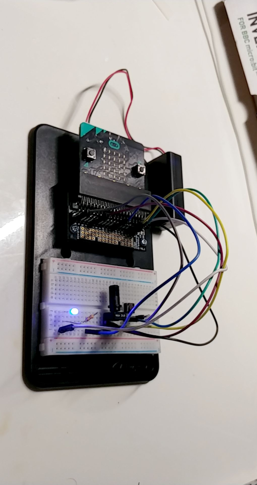
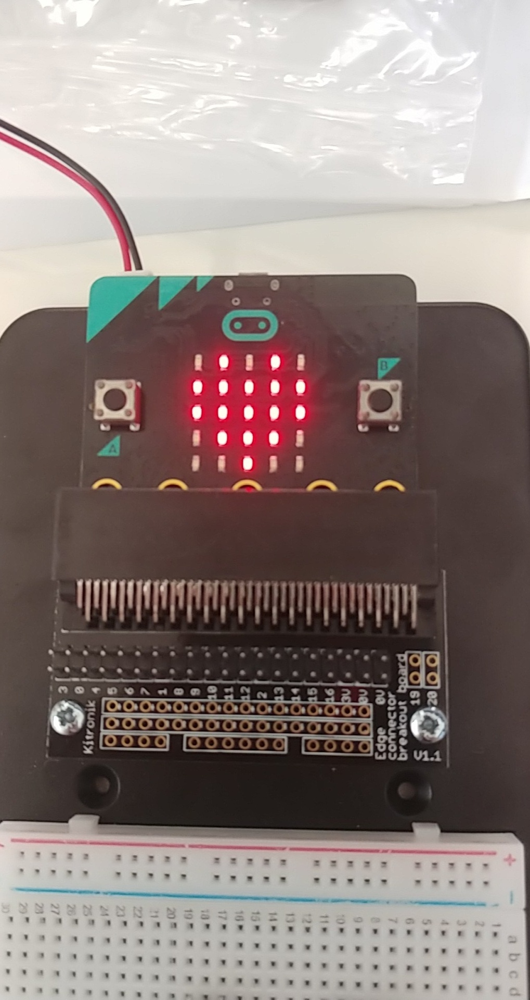
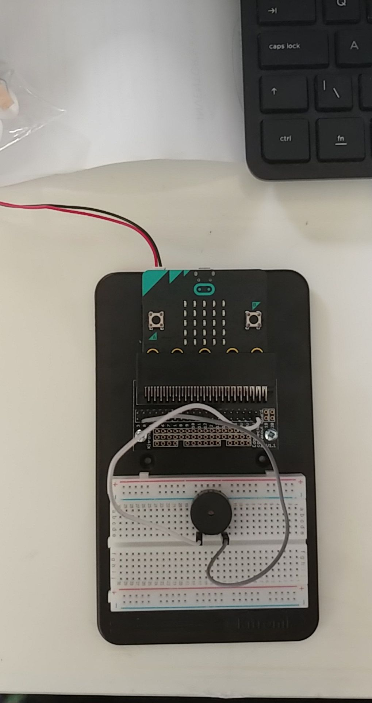
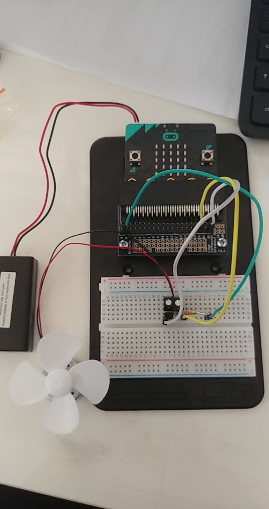

# Inventor Kit Experiments

*Markdown reference: https://guides.github.com/features/mastering-markdown/*

## Instructions ##

*For a selection of 5 inventor kit experiments that you choose, fill out the following sections.

### Using a light sensor & analog inputs ###

#### Photo of completed project ####
*In the code below, replace `missingimage.png` with the name of the image, which should be in the `kitexperiments` folder.*

Photo of a breadboard, three female to male jumper wires, a resistor, a transistor, a battery pack and a BBC Micro:Bit. 

#### Reflection ####

In this experiment, I was able to learn what a phototransistor is and how it functions on a basic level. A phototransistor reacts to differing light levels and shows this through how well it conduct electricity - the more light that is shone on the transistor, the more effectively it transmits electricity. 

This experiment could be the basis of a real world application such as daylight sensors, smoke detecters, infrared receivers, etc. 

### Dimming an LED using a potentiometer ###

#### Photo of completed project ####
In the code below, replace imagemissing.jpg with the name of the image, which should be in the kitexperiments folder.

Photo of a potentiometer, a push-switch, a blue LED, seven female to male jumper wires, a resistor, a breadboard, battery pack, and a BBC Micro:Bit

#### Reflection ####

In this experiment, I made contact with a potentiometer. Before this experiment, I wouldn't have known what said object is. After completing the project, I understood that a potentiometer is quite literally a dimmer switch in a sense. 

This experiment could be the basis of a real world application such as mood lighting.

### Say "Hello" to the BBC nicro:bit! ###

#### Photo of completed project ####
In the code below, replace imagemissing.jpg with the name of the image, which should be in the kitexperiments folder.

Photo of a breadboard, BBC Micro:Bit, battery pack, push switch and four female to male jumper wires. 

#### Reflection ####

In this experiment, I leanrt about 'stings' on a very basic level. This had been one of the very first experiments I had completed during this course. It was an excellent introduction to making interaction.

This experiment could be the basis of a real world application such as childrens toys, elevators, computers, etc. 

### Setting the tone with a Piezo Buzzer###

#### Photo of completed project ####

Photo of a Piezo buzzer, bread board, two female to male jumper wires, battery pack and a BBC Micro:Bit.

#### Reflection ####

In this experiment, I was able to learn hoe to 'code' and play music via the micro:bit and the Piezo buzzer. It was thoroughly enjoyable to attempt to recreate some of my favourite little tunes while learning at the same time. 

This experiment could be the basis of a real world application such as door bells, toys, etc. 

### Using a transistor to drive a motor ###

#### Photo of completed project ####

Photo of a transistor, breadboard, battery pack, BBC Micro:Bit, motor, three female to male jumper wires, fan blade, terminal connector, and a resistor. 

#### Reflection ####

In this experiment, I was able to learn that you can use a transistor as a sort of gate for energy to flow through. 

This experiment could be the basis of a real world application such as ......(insert something here).

