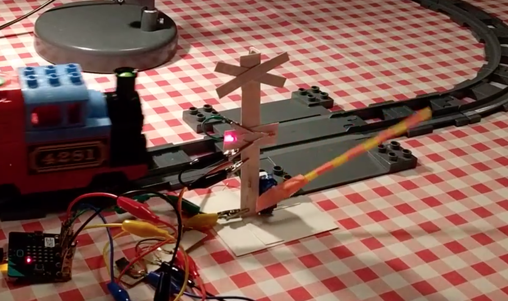
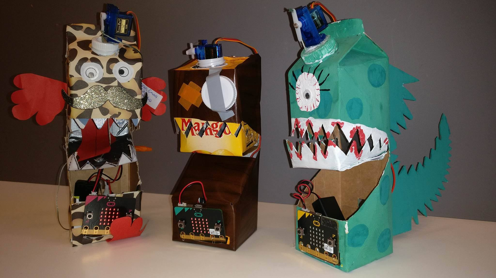

# Assessment 1: Replication project

*Fill out the following workbook with information relevant to your project.*

*Markdown reference:* [https://guides.github.com/features/mastering-markdown/](http://guides.github.com/features/mastering-markdown/)

## Replication project choice ##
"Guitar"

## Related projects ##
*Find about 6 related projects to the project you choose. A project might be related through  function, technology, materials, fabrication, concept, or code. Don't forget to place an image of the related project in the* `replicationproject` *folder and insert the filename in the appropriate places below. Copy the markdown block of code below for each project you are showing, updating the number* `1` *in the subtitle for each.*

### Related project 1 ###
Banana Keyboard

https://makecode.microbit.org/projects/banana-keyboard

This project is related to mine because it follows the similar concept of a musical instrument. 

### Related project 2 ###
Light Level Meter

https://makecode.microbit.org/projects/light-level-meter

This project is related to mine because I used a very similar code in order to measure light intensity with my micro:bit. 

### Related project 3 ###
Rotary Dial Radio 

https://makecode.microbit.org/projects/rotary-dial-radio

This project is related to mine because they used a similar concept of plotting graphs in order to calculate and detect pulses, much like how I used plotting graphs in order to calculate light levels and xyz axes.

### Related project 4 ###
Railway crossing

https://makecode.microbit.org/projects/railway-crossing

This project is related to mine because it used code to detect light levels, which would cause crossing gate (?) to eiher lift or drop depending on the level of light detected. My project acted in a similar way except with changing temp and octave rather than dropping or lifting a crossing gate (?)

### Related project 5 ###
Milk Monster

https://makecode.microbit.org/projects/milky-monster

This project is related to mine because, like a few of the other mentioned projects, this too uses a light sensor.

### Related project 6 ###
Inchworm

https://makecode.microbit.org/projects/inchworm

This project is related to mine because it also makes use of the "pause" code block. However, unlike the guitar project, the inchworm utilises it to pause the worm's movement for a moment. 

## Reading reflections ##
*Reflective reading is an important part of actually making your reading worthwhile. Don't just read the words to understand what they say: read to see how the ideas in the text fit with and potentially change your existing knowledge and maybe even conceptual frameworks. We assume you can basically figure out what the readings mean, but the more important process is to understand how that changes what you think, particularly in the context of your project.*

*For each of the assigned readings, answer the questions below.*

### Reading: Don Norman, The Design of Everyday Things, Chapter 1 (The Psychopathology of Everyday Things) ###

*What I thought before:* 

Most people don't tend to give much thought to everyday objects and why they're designed the way they are. Before reading this chapter, I only occasionally gave thought to the design of everyday objects, but never truly questioned their design. 

*What I learned:* 

After reading this chapter my viewpoint of the design of everyday objects has changed. I now question the design of most common objects I come across throughout my days - especially the dreaded door. Through reading this chapter I was also able to add the term 'discoverablity' to my vocabulary and that it is an esential part of all design. It was said that many products fail because they lack discoverability and understanding. 

Describe what you now know or believe as a result of the reading. Don't just describe the reading:*

Thanks to this reading, my understanding of design has improved. If only I had been asked to read this a few years ago, the products I produced in my IT class (in highschool) would have been 1000 times better. The chapter read covers essential bases of design, which include; Human Centered Design and the fundamental principals of interaction. Human Centered Design, or HCD is absolutly essential as it determines whether a design matches the capablites and needs of its target audiance. An example of this could be Google Maps and its voice assistant which gives you directions while driving without having to glance down at the drivers smartphone. The implementation of this voice assistant would have prevented many potential car accidents. The fundamental principals of interaction encompass five psycological concepts; Affordances, Signifiers, Mapping, Feedback, and Conceptual Models. Affordances is all about the relationship of information we are able to glean from around us. Signifiers are the properties that aid us in determining where the action takes place (signifiers include signs, drawings and labels.) Mapping is the relationship between two sets of things. For example, while driving a car, the steering wheel creates a sort of map for direction. Feedback is relatively self explanitory. The lack of feedback will create frustration while using any product. Receiving feedback from an object is very important as it allowed you to truly interact with it. Conceptual models are a highly simplified explanation of how something works. Conceptual models can vary depending on the user, their culture or their religion. 

*What I would like to know more about:* 

I would definitely like to learn more about human centered design as it is so essential to all products produced in the world. 

*How this relates to the project I am working on:* 

The concept of this chapter relates to my replication project as there is constant feedback between the object (guitar) and the user. Through this constant feedback, it encourages the user to explore and experiment with the object in order to discover what the object can do. 

### Reading: Chapter 1 of Dan Saffer, Microinteractions: Designing with Details, Chapter 1 ###

*What I thought before:*

Before reading chapter one of this book I was not entirely aware of microinteractions all the time. The only times I became truly aware of these microinteractions is usually while playing video games, expecially ones that have incredible detail, whether this be the way you character interacts with the environment around them (e.g. hair/clothing texture changing with the environment around them) or with npcs, etc. 

*What I learned:* 

Through reading this chapter I was able to gain a better understanding of microinteractions and how important they really are. Microinteractions are the small pieces of functionality that are all around us and make our overall experiences better. 

*What I would like to know more about:* 

I am curious as to what deisgn would be like without microinteractions and how much we really take it for granted. 

*How this relates to the project I am working on:*

The information in this chapter relates to my project by looking at all of the small calculations the micro:bit makes while on. The micro:bit is constantly calculating and adjusting to light intensity and xyz axes in order to determine which notes will be played through the attached speaker. 

### Reading: Scott Sullivan, Prototyping Interactive Objects ###

*What I thought before:* 
Before this reading i had always struggled with following a proper planning and prototyping structure for projects. This was a bad habit in my IT class in highschool as I would always get overexcited about a new project and drive head first into it. However, after reading this, I realise just how important prototyping is. (I'm surprised all my projects in highschool went so well! haha)

*What I learned:*
Through reading this piece, I was able to learn possibly one of this most important and inspirational things when it comes to fears. It's difficult to put into words, but this quote from the reading expresses it perfectly: "* I’ve likened this process to being punched in the face: if you’ve never been punched in the face, it seems like just about the worst thing that could happen to you, but when it happens you think “oh that wasn’t so bad, I survived and it doesn’t hurt too much,” and from that point forward you’re not so scared of that punch anymore! *". 

I find I'm always so intimidated when wanting to learn new things or start new projects because, well, I simply never know where to start and what to expect. 

*What I would like to know more about:*
I would love to know more about any of Scott Sulivan's other projects as this read truly inspired me to try new things!

*How this relates to the project I am working on:*
I find Scott Sulivan's project really relates to mine more on a mental than physical level, as he had explored a new area of knowledge for himself and I have done much the same with this guitar project. 

## Interaction flowchart ##
*Draw a flowchart of the interaction process in your project. Make sure you think about all the stages of interaction step-by-step. Also make sure that you consider actions a user might take that aren't what you intend in an ideal use case. Insert an image of it below. It might just be a photo of a hand-drawn sketch, not a carefully drawn digital diagram. It just needs to be legible.*

## Process documentation

*In this section, include text and images that represent the development of your project including sources you've found (URLs and written references), choices you've made, sketches you've done, iterations completed, materials you've investigated, and code samples. Use the markdown reference for help in formatting the material.*

*This should have quite a lot of information!*

*There will likely by a dozen or so images of the project under construction. The images should help explain why you've made the choices you've made as well as what you have done. Use the code below to include images, and copy it for each image, updating the information for each.*

*Include screenshots of the code you have used.*

## Project outcome ##

*Complete the following information.*

### Project title ###
Guitar

### Project description ###

The purpose of this project was to design and create an 'electric guitar'. In order to play said guitar and play various notes, you must expose the micro:bit attached to various light intensities and rotate the guitar on the x, y, and z axes. I believe this project is aimed towards late primary school to early highschool children/adolescence or people who are very new to the BBC micro:bit. A typical use for this project would be to intrudce people to the BBC micro:bit as it teaches them many different functions of the said computer. 

### Showcase image ###

*Try to capture the image as if it were in a portfolio, sales material, or project proposal. The project isn't likely to be something that finished, but practice making images that capture the project in that style.*

### Additional view ###

*Provide some other image that gives a viewer a different perspective on the project such as more about how it functions, the project in use, or something else.*

### Reflection ###

I believe the parts of this project that were the most successful were definitely the aesthetic outcome, and coding the light intensity readings. I found that I needed to improve my wire placement and the organisation of my code, as well as creating a constatly functioning 'on' and 'off' switch. I had tested this 'switch' a 3 times and I found that it only worked for 2 of the 3 three tests, however this could have just been me not making a proper connection with the wires or a small issue in the code. Regardless, this 'switch' function still worked in the final recording of this project, which was a relief! I also needed to improve my organisation a little more as I innitially had another project planned and almost completed. This aforementioned project was a combination of the banana keyboard and this guitar task, but I was unable to make the code function to my liking. Regardless, I was able to complete this guitar task more to my liking and thoroughly enjoyed the entire process of this project. 

I was able to gain a lot of information and do's and don't's from the aforementioned failed project. Because of having some prior experience thanks to the mentioned 'banana-guitar' project fail, I was able to plan and execute the guitar project to a finer standard and have a better understanding of what I was actually doing. 

I believe the most helpful ideas and tips I had come accross were during the making interaction tutorials which occured every friday. That class is also where I obviously learned all the important information I really needed to know for this project and following projects. 

I think an interesting extention on this project could be creating a whole 'band' and experimenting with the spead and octave in which the notes are played. It would be really enjoyable to see how this extention would look physically as I would need to come up with various designs which are obvious enough for passerbys to understand what these 'instrucments' are and how they could possibly interact with them. 
